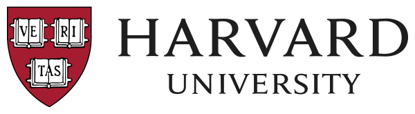

  
  <h1>This Is CS50</h1>
  

    Welcome to <strong>Jesky's Archive</strong>.
     
    <a href="https://www.edx.org/learn/computer-science/harvard-university-cs50-s-introduction-to-computer-science">Harvard CS50 - Introduction to Computer Science</a>
  

🚧 <strong>THIS REPOSITORY IS NO LONGER MAINTAINED AFTER 2024</strong> 🚧

### What is this repository about?

This repository contains my archived solutions to tasks from various CS50 courses offered by Harvard University in 2024 on edX, including CS50, CS50P, CS50AI, and others.

The solutions are implemented in C or Python. Please note that the C solutions use the CS50 exclusive library (cs50.h), which is not available for local use without the CS50 environment.

### Disclaimer

> [!WARNING]  
> Using someone else's code violates academic honesty guidelines.

This repository was created solely for educational purposes, and cheating or similar activities are strongly discouraged. All the code here represents solutions I developed independently through my own problem-solving efforts. These solutions are intended for those who have completed the problem sets and wish to explore alternative approaches, enhance their learning experience, or gain new insights.

As part of my learning journey, my solutions are far from perfect. They may not be the most efficient, the most readable, or the best, but they reflect my progress and efforts.

Please note that all problem sets included in this archive are the property of <strong>Harvard University</strong>
